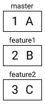
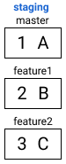
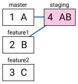
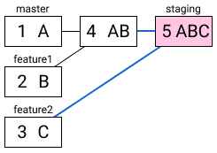
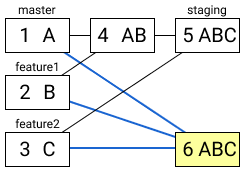
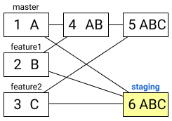

# Merge Bot Core

This directory contains the Haskell package that defines core merge bot
functionality.

## Merge algorithm

A try job or a merge job creates a new branch that will have tests run against
it. To keep the git history clean, we would like the new branch to be exactly
one commit ahead of the base branch, whose commit parents are, first, the HEAD
of the base branch, then the HEAD of all branches being tried/merged.

Creating a merge branch with these properties using the GitHub API is a rather
intensive process, for a few reasons:

1. GitHub's endpoint to merge two branches only allows merging one branch at a
   time.
1. When creating a commit, you must specify the tree hash that points to a tree
   containing the already-merged files.

Here are the steps we would take to create a merge branch using the GitHub API:

1. Say we have two PRs against `master`, one for the `feature1` branch, and one
   for the `feature2` branch. The `master` branch is at commit `1` with the
   tree hash `A`. Similarly, the `feature1` branch is at commit `2` with the
   tree hash `B`, and the `feature2` branch is at commit `3` with the tree hash
   `C`. We want to merge both of these branches/PRs into `master`.

    

1. First, we create the `staging` branch off `master`.

    

1. Then, we merge `feature1` into `staging`. GitHub creates a new commit for us
   (commit `4`), with a new tree hash `AB`, which is the result of merging
   trees `A` and `B`.

    

1. Then, we merge `feature2` into `staging`. GitHub, again, creates a new
   commit `5` with a new tree hash `ABC`, the result of merging `AB` and `C`.

    

1. Now we take the final tree hash `ABC` and create a new commit with it,
   specifying the commit's parents as the `master` branch, and then the two
   `feature*` branches.

    

1. Lastly, we forcibly update the `staging` branch to refer to commit `6`.

    
